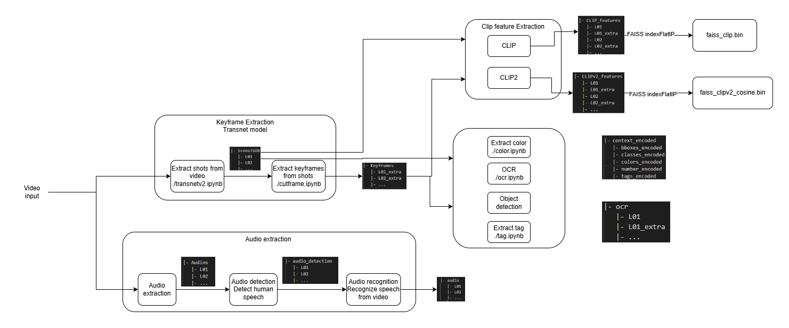

# Dataset extraction
## Pipeline
https://app.diagrams.net/#G1gc3X5YlXckrcA6LzoNItkxWqM2Ds4bT1#%7B%22pageId%22%3A%22gfNFXgkiRMqiiLaPGVTi%22%7D
<p align="center" width="100%">
     
</p>

## Data directory
Prepare data directory as:
```
|- AIC_Video 
   |- Videos_L01
   |- Videos_L02
   |- ...
|- AIC_Video 
   |- Videos_L01
   |- Videos_L02
   |- ...

```


## Usage
- Keyframe extraction: [transnet](transnet/README.md)
- Audio extraction: [audio](audio/README.md)
- Metadata extraction: [metadata](metadata/README.md)
- Clip features extraction:: [clip](clip/README.md)
- Run [create.ipynb](./create.ipynb) for bin generation
- Run [data_preparation.ipynb](./data_preparation.ipynb)

